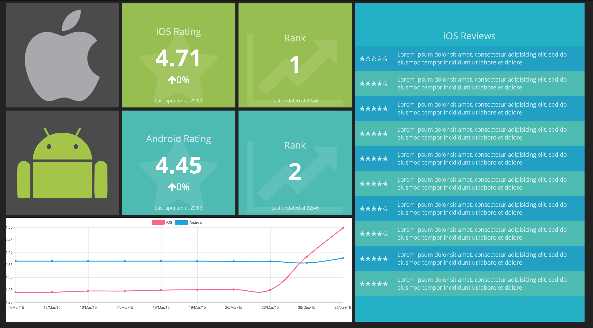

# Mobile Dashboard



## Intro
This repo is customization for the beautiful project: [smashing](https://github.com/Smashing/smashing). Check the original repository if you're looking for a way of making your dashboard.

## AppAnnie API
The data are coming from the [AppAnnie API](https://www.appannie.com/de/tours/app-analytics-platform/). Free accounts on AppAnnie can have limitations on the usage of the API. Check the AppAnnie's website for more information.


## Features

* Shows data for two apps, one android and one iOS
* Fetches **and stores** the user rating and shows in a chart.
* Shows the current rating
* Shows the current ranking in one selected category
* Shows the list of latest 10 iOS reviews.


## Configuration
The project uses [DotEnv](https://github.com/bkeepers/dotenv) to load all the sensible information.
To use your data create a `.env` file with these variables

```bash
APPANNIE_APIKEY=<your appannie api key>
IOS_APP_ID=<ios application id from ITC>
IOS_PRIMARY_CATEGORY=<the selected category as reported on appannie api>
ANDROID_APP_ID=<android application id>
ANDROID_PRIMARY_CATEGORY=<the selected category as reported on appannie api>
```

To find the exact name of the category you're interested, refer to the AppAnnie _Category list_ API. [here](https://support.appannie.com/hc/en-us/articles/115014388108-2-Category-List)


## Start

1. Clone this repository
2. Add the `.env` file with your data
3. run `bundle install`
4. run `smashing run`
5. Open your browser to [http://localhost:3030](http://localhost:3030)
6. Enjoy